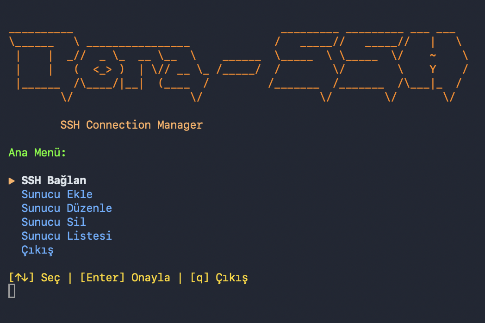

# 🚀 Bora-SSH

**OpenSource CLI SSH Client for Macbook** 🍎

[](https://opensource.org/licenses/MIT)
[](https://www.apple.com/macos/)

*Modern, colorful, and intuitive SSH connection manager for macOS*

---

## 📸 Main Menu View



---

## ✨ Features

### 🎨 **Modern TUI Design**
- Colorful ASCII art header with soft orange tones
- Terminal-based user interface (TUI)
- Smooth menu navigation

### ⌨️ **Easy Navigation**
- **Arrow keys** (↑↓) for menu navigation
- **Enter** to confirm selection
- **q** or **Esc** to exit

### 💾 **Server Management**
- ✅ Add, edit, and delete servers
- ✅ List saved servers
- ✅ Quick SSH connection
- ✅ Automatic server saving

### 🪟 **Terminal Management**
- ✅ New SSH connections automatically open in new Terminal window
- ✅ Main script window stays open
- ✅ Server information in tab titles

### 🔐 **Security**
- ✅ Standard SSH protocol
- ✅ Password and SSH key support
- ✅ Secure server information storage (`~/.bora-ssh/servers.conf`)

---

## 📦 Installation

### Quick Start

```bash
# Clone the repository
git clone https://github.com/boracomet/Bora-SSH.git
cd Bora-SSH

# Make the script executable
chmod +x bora-ssh.sh

# Run the script
./bora-ssh.sh
```

---

## 🚀 Usage

### Main Menu

When the script is run, a colorful ASCII art header and main menu are displayed:

- **Connect SSH** - Connect to saved servers via SSH
- **Add Server** - Add and save a new server
- **Edit Server** - Edit existing server information
- **Delete Server** - Delete a saved server
- **List Servers** - View all saved servers
- **Exit** - Exit the program

### Navigation Shortcuts

| Key | Function |
|-----|----------|
| `↑` `↓` | Navigate between menu items |
| `Enter` | Confirm selected item |
| `q` | Exit |

### Adding a Server

1. Select **"Add Server"** from the main menu
2. Enter server information:
   ```
   Server Name: Production Server
   Host/IP: 192.168.1.100
   User: root
   Port: 22
   ```
3. Type **"y"** (yes) if you want to save

Server information is saved to the `~/.bora-ssh/servers.conf` file.

### SSH Connection

1. Select **"Connect SSH"** from the main menu
2. Select a server from the saved servers list
3. SSH connection opens in a new Terminal window
4. Main script window stays open, you can add new connections

---

## ⚙️ Configuration

### Server File

Server information is stored in:
```
~/.bora-ssh/servers.conf
```

Each line is in the following format:
```
ServerName|Host|User|Port
```

**Example:**
```
Production|192.168.1.100|root|22
Development|dev.example.com|admin|2222
Staging|staging.example.com|deploy|22
```

**⚠️ Security Note:** The `servers.conf` file contains sensitive information and has been added to `.gitignore`, so it will not be uploaded to Git.

---

## 📋 Requirements

- **macOS** (tested)
- **Bash** 4.0+
- **SSH** commands (available by default on macOS)
- **Terminal.app** (macOS default terminal application)

---

## 🎯 Example Usage Scenarios

### Scenario 1: First Use

```bash
$ ./bora-ssh.sh

# Main menu is displayed
# "Add Server" is selected
# Server information is entered and saved
# Connection is established with "Connect SSH"
```

### Scenario 2: Multiple Server Management

```bash
# Connecting to multiple servers
$ ./bora-ssh.sh

# 1. Connect to Production Server
# 2. New Terminal window opens
# 3. Return to main menu
# 4. Connect to Development Server
# 5. New Terminal window opens
```

---

## 🛠️ Development

### Project Structure

```
Bora-SSH/
├── bora-ssh.sh          # Main script
├── README.md            # This file
├── .gitignore           # Git ignore file
└── LICENSE              # MIT License
```

### Contributing

1. Fork the repository
2. Create a feature branch (`git checkout -b feature/amazing-feature`)
3. Commit your changes (`git commit -m 'Add amazing feature'`)
4. Push to the branch (`git push origin feature/amazing-feature`)
5. Open a Pull Request

---

## 📝 Notes

- The script uses a terminal-based TUI (Text User Interface)
- Colors depend on terminal support (256 colors recommended)
- SSH keys or passwords are used for SSH connections
- New SSH connections automatically open in a new Terminal window
- Main script window stays open, allowing you to manage multiple connections
- Server information is stored in `~/.bora-ssh/servers.conf` and is not uploaded to Git

---

## 📄 License

This project is licensed under the [MIT License](LICENSE).

```
MIT License

Copyright (c) 2026 Bora

Permission is hereby granted, free of charge, to any person obtaining a copy
of this software and associated documentation files (the "Software"), to deal
in the Software without restriction, including without limitation the rights
to use, copy, modify, merge, publish, distribute, sublicense, and/or sell
copies of the Software, and to permit persons to whom the Software is
furnished to do so, subject to the following conditions:

The above copyright notice and this permission notice shall be included in all
copies or substantial portions of the Software.

THE SOFTWARE IS PROVIDED "AS IS", WITHOUT WARRANTY OF ANY KIND, EXPRESS OR
IMPLIED, INCLUDING BUT NOT LIMITED TO THE WARRANTIES OF MERCHANTABILITY,
FITNESS FOR A PARTICULAR PURPOSE AND NONINFRINGEMENT. IN NO EVENT SHALL THE
AUTHORS OR COPYRIGHT HOLDERS BE LIABLE FOR ANY CLAIM, DAMAGES OR OTHER
LIABILITY, WHETHER IN AN ACTION OF CONTRACT, TORT OR OTHERWISE, ARISING FROM,
OUT OF OR IN CONNECTION WITH THE USE OR OTHER DEALINGS IN THE SOFTWARE.
```

---

## 👤 Author

**Bora**

- GitHub: [@boracomet](https://github.com/boracomet)
- Repository: [Bora-SSH](https://github.com/boracomet/Bora-SSH)

---

## 🙏 Acknowledgments

- Thanks to all contributors!
- Thanks to the open source community!

---

<div align="center">

**⭐ If you liked this project, don't forget to give it a star! ⭐**

Made with ❤️ for macOS users

</div>
